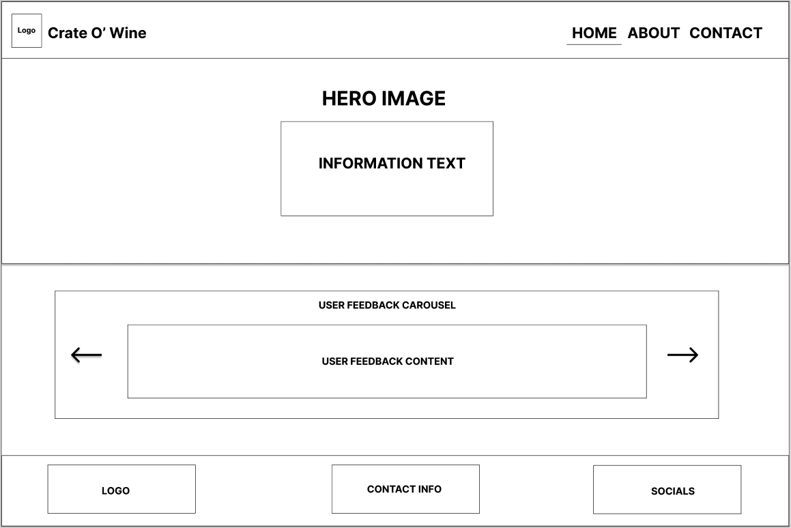
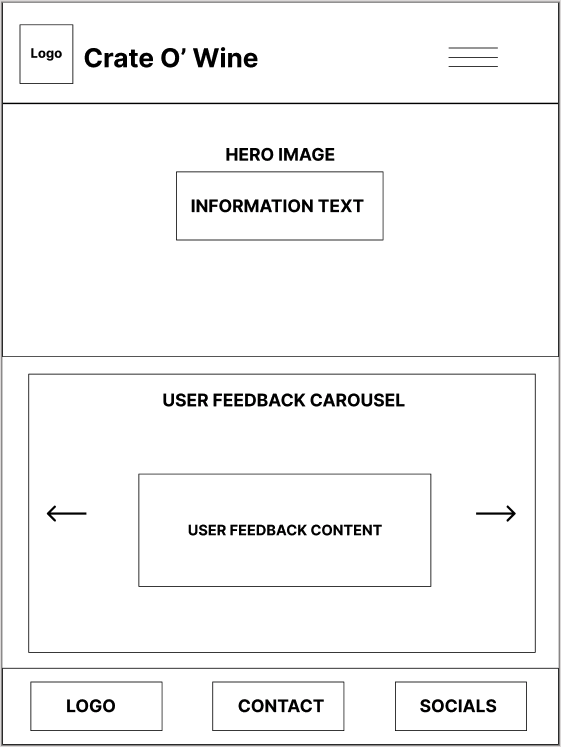
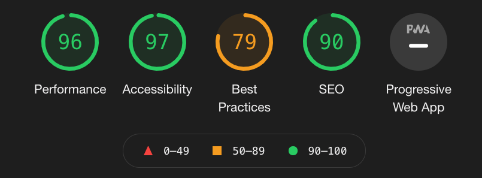
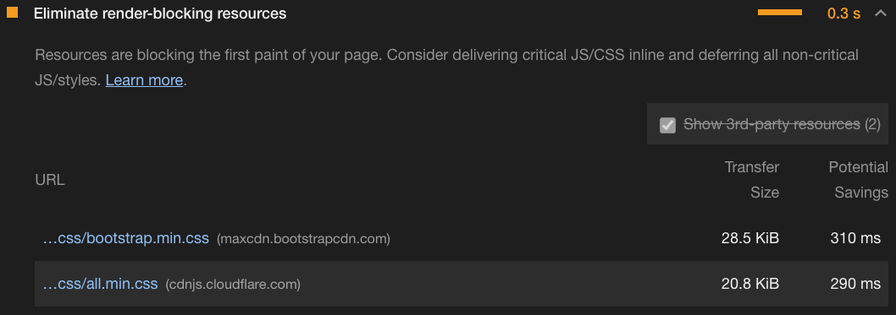

<h1 style="color: #5e0323; font-family: 'Satisfy'; font-size: 80px;">Crate O' Wine</h1>

---

Crate O' Wine is a monthly wine subscription that allows customers to receive a new assortment of wines every month to their doorstep.

It was designed and built with a mobile-first development strategy. This was possible by leveraging Bootstrap.

Website deployed using GitHub Pages - [See Live](https://kenwilde1.github.io/crate-o-wine/).

## Table of Contents

- [Project Purpose](https://github.com/kenwilde1/crate-o-wine#crate-o-wine)
- [User Experience (UX)](https://github.com/kenwilde1/crate-o-wine#user-experience-ux)
  - [Objective](https://github.com/kenwilde1/crate-o-wine#objective)
  - [User Goals and Stories](https://github.com/kenwilde1/crate-o-wine#user-goals-and-stories)
  - [Wireframes](https://github.com/kenwilde1/crate-o-wine#wireframes)
- [Site Components](https://github.com/kenwilde1/crate-o-wine#site-components)
  - [Existing Site Components](https://github.com/kenwilde1/crate-o-wine#existing-site-components)
  - [Components to Implement](https://github.com/kenwilde1/crate-o-wine#components-to-implement)
- [Design]()
  - [Design Considerations]()
  - [Design Choices]()
- [Technologies Used]()
- [Testing](https://github.com/kenwilde1/crate-o-wine#testing)
  - [PageSpeed Insights](https://github.com/kenwilde1/crate-o-wine#pagespeed-insights)
  - [Google Lighthouse](https://github.com/kenwilde1/crate-o-wine#google-lighthouse)
  - [Resonsiveness Testing](https://github.com/kenwilde1/crate-o-wine#responsiveness-testing)
- [Deployment]()
- [Media]()
- [Conclusion]()

## User Experience (UX)

### Objective

The Objective of the UX process was to provide end-user (potential customers) with a clear and succint way to interact and retrieve information from within the website. Through this, we avoid overwhelming the end-user with too much information and give them the freedom to navigate the website as they please.

A Secondary Objective served to provide a short path to drive users towards purchasing the product. It was important to do this in as few clicks as possible in order to hold onto the end-user's attention.

### User Goals and Stories

As an End-User, the goal is to learn about the product so you can make an educated purchasing decision. As the Site Owner, in order to help the end-user achieve this goal, the website was designed to provide freedom of navigation with clear and succint data points. As the end-user becomes overwhelmed with buttons, paragraphs and other components, the chance of leaving the page increases.

Every component of the website was built with a User Story in mind. This included NavBar, Carousels, Information Containers, Footers etc. No component was built without providing a User Story as a form of justification.

You can view the User Stories [here]('./assets/docs/User-Stories.pdf'). For every user story, a visual card was created. It had a 'title' which served as the reason to build out a selected feature. Below that, you can see that _why_ the user would want this.

### Wireframes

Wireframes were created pre-emptively in order to provide a schematic for how the website would look on every page and device. The Wireframes covered Desktop, Tablet and Mobile for responsive design. They are an original mock-up and some components may vary on the live preview of the website.

You can view the Wireframes [here]('./assets/docs/Wireframes-Desktop-Tablet-Mobile.pdf').

Here is a preview of the Home page on Desktop, Tablet and Mobile:

- ##### Desktop

  

- ##### Tablet

  

- ##### Mobile
  

## Site Components

### Existing Site Components

- #### Navbar

  The Navbar serves as a source of navigation and design. On the left side of the navbar, it contains the logo and title 'Crate O' Wine'. This is clickable and brings the user back to the homepage. On the right side of the navbar are our nav links - Home, About and Contact, respectively.

- #### Hero Image

  The Hero Image component will be the first thing the user sees and is implemented to grab attention. It contains a text box in the center that containts two links - read more and start now. Read More will bring the user to the About page where they can be informed about the product. Start Now will bring the user to the Contact page where they can subsequently get in touch to start the subscription.

- #### Promise Container

  The Promise component informs the user of a fairtrade guarantee, it contains a button that brings them to the About page to learn more about this.

- #### User Feedback Carousel

  The User Feedback Carousel is a text and image slide of people who have subscribed to the product and left feedback. It's goal is to gain trust with the user.

- #### Information Container

  The Information container, located on the About page, will educate the User on exactly what they need to know about the product - the How, What, Where.

- #### Subscription Plans

  This section gives the user a list of available subscription plans - standard and premium. They are presented in the form of panes, they provide a basic overview of each plan - description and price. Both plans have a button that brings up a Modal.

- #### Subscription Modals

  As mentioned previously, clicking on the button in the subscription plans brings up a modal. This provides in-depth details of what exactly each plan offers.

- #### Fairtrade Container

  As mentioned before with the promise container, it's button brings the user here. This is a container to explain why each wine on offer is fairtrade guaranteed. Put simply, it educates the user on why this is a core value of the product.

- #### Contact Form
  Within the scope of this project, the contact form is the place that the User declares their interest in starting a monthly subscription. It provides input fields and validation. In addition, there is a google maps embed along with the physical address.

### Components to Implement

- #### Checkout

  In the future, the user should be able to select a plan and perform a checkout for the plan they selected. This would include a cart-like system and a purchasing container.

- #### Gallery
  An Image Gallery showing visual aspects of these crates can also capture a user's interest in the product. As the company is fictitious, this was not possible to implement during development.

## Technologies Used

- [HTML5](https://developer.mozilla.org/en-US/docs/Web/Guide/HTML/HTML5)

  - The project uses **HTML5** to structure the components of the pages, this includes the Nav, Main Content and Footer.

- [CSS3](https://developer.mozilla.org/en-US/docs/Web/CSS)

  - The project uses **CSS3** to add styling to certain components of the page.

- [Bootstrap 4](https://developer.mozilla.org/en-US/docs/Web/CSS)

  - The project uses **Bootstrap 4** to tell the browser how the page layout should look using containers, rows and columns. Each component on the page uses Bootstrap and/or Flexbox to provide layout.

- [Git](https://git-scm.com/)
  - At every significant change, the changes were committed using Git and Github. This was done to keep track of changes, have a remote repository for protection against redundancy.

## Testing

### PageSpeed Insights

I ran the deployed site through Google's page speed insights. It recommended that up to 4.8 seconds could be saved by compressing all the images into a modern web format.

To remedy this, I compressed all .jpg files into .webp. This reduced the image size by > 50% and thus helped increase page speed.

### Google Lighthouse

Google Lighthouse was used to test many factors of the website, mainly - Performance, Accessibility, Best Practices and Search Engine Optimisation.

 

The test scored very well in all tested factors. Best practices scored an ~80 due to some render-blocking resources. However, upon diving into these resources, I determined they were critical - bootstrap and font-awesome. They needed to stay in the `<head>` tag so the bootstrap grid and icons were available on page-load.

 

### Responsiveness Testing

Before every `git push` to the remote branch, the website was checked for responsiveness to ensure no changes made were breaking.

In this section, you need to convince the assessor that you have conducted enough testing to legitimately believe that the site works well. Essentially, in this part you will want to go over all of your user stories from the UX section and ensure that they all work as intended, with the project providing an easy and straightforward way for the users to achieve their goals.

Whenever it is feasible, prefer to automate your tests, and if you've done so, provide a brief explanation of your approach, link to the test file(s) and explain how to run them.

For any scenarios that have not been automated, test the user stories manually and provide as much detail as is relevant. A particularly useful form for describing your testing process is via scenarios, such as:

1. Contact form:
   1. Go to the "Contact Us" page
   2. Try to submit the empty form and verify that an error message about the required fields appears
   3. Try to submit the form with an invalid email address and verify that a relevant error message appears
   4. Try to submit the form with all inputs valid and verify that a success message appears.

In addition, you should mention in this section how your project looks and works on different browsers and screen sizes.

You should also mention in this section any interesting bugs or problems you discovered during your testing, even if you haven't addressed them yet.

If this section grows too long, you may want to split it off into a separate file and link to it from here.

## Deployment

This section should describe the process you went through to deploy the project to a hosting platform (e.g. GitHub Pages or Heroku).

In particular, you should provide all details of the differences between the deployed version and the development version, if any, including:

- Different values for environment variables (Heroku Config Vars)?
- Different configuration files?
- Separate git branch?

In addition, if it is not obvious, you should also describe how to run your code locally.

## Credits

### Content

- The text for section Y was copied from the [Wikipedia article Z](https://en.wikipedia.org/wiki/Z)

### Media

- The photos used in this site were obtained from ...

### Acknowledgements

- I received inspiration for this project from X
