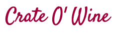
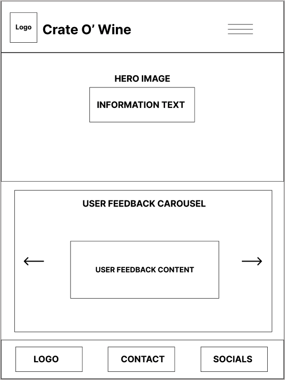
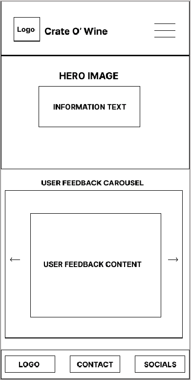
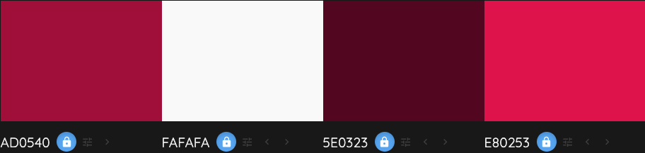

<p style="text-align: center">


<p>

---

Crate O' Wine is a monthly wine subscription that allows customers to receive a new assortment of wines every month to their doorstep.

It was designed and built with a mobile-first development strategy. This was possible by leveraging Bootstrap.

Website deployed using GitHub Pages - [See Live](https://kenwilde1.github.io/crate-o-wine/).

## Table of Contents

- [User Experience (UX)](https://github.com/kenwilde1/crate-o-wine#user-experience-ux)
  - [Objective](https://github.com/kenwilde1/crate-o-wine#objective)
  - [User Goals and Stories](https://github.com/kenwilde1/crate-o-wine#user-goals-and-stories)
  - [Wireframes](https://github.com/kenwilde1/crate-o-wine#wireframes)
- [Site Components](https://github.com/kenwilde1/crate-o-wine#site-components)
  - [Existing Site Components](https://github.com/kenwilde1/crate-o-wine#existing-site-components)
  - [Components to Implement](https://github.com/kenwilde1/crate-o-wine#components-to-implement)
- [Design](https://github.com/kenwilde1/crate-o-wine#design)
  - [Design Considerations](https://github.com/kenwilde1/crate-o-wine#design-considerations)
  - [Design Choices](https://github.com/kenwilde1/crate-o-wine#design-choices)
- [Technologies Used](https://github.com/kenwilde1/crate-o-wine#technologies-used)
- [Testing](https://github.com/kenwilde1/crate-o-wine#testing)
- [Deployment](https://github.com/kenwilde1/crate-o-wine#deployment)
- [Credits](https://github.com/kenwilde1/crate-o-wine#credits)
  - [Media](https://github.com/kenwilde1/crate-o-wine#media)
  - [Acknowledgements](https://github.com/kenwilde1/crate-o-wine#acknowledgements)

## User Experience (UX)

### Objective

The Objective of the UX process was to provide end-user (potential customers) with a clear and succinct way to interact and retrieve information from within the website. Through this, we avoid overwhelming the end-user with too much information and give them the freedom to navigate the website as they please.

A Secondary Objective served to provide a short path to drive users towards purchasing the product. It was important to do this in as few clicks as possible in order to hold onto the end-user's attention.

### User Goals and Stories

As an End-User, the goal is to learn about the product so you can make an educated purchasing decision. As the Site Owner, in order to help the end-user achieve this goal, the website was designed to provide freedom of navigation with clear and succinct data points. As the end-user becomes overwhelmed with buttons, paragraphs and other components, the chance of leaving the page increases.

Every component of the website was built with a User Story in mind. This included NavBar, Carousels, Information Containers, Footers etc. No component was built without providing a User Story as a form of justification.

- As a User I want to learn about the service so that I can make an educated purchase.
- As a User I want to see customer feedback so I can gain trust in the service.
- As a User, I want to navigate pages so that I can learn more about the service at my own leisure.
- As a User, I want to read in-depth information about the service so I can make an educated purchasing decision.
- As a User, I want to contact the product owner to gain more information about the service
- As a User, I want to view the subscription plans so that I can decide which one is best for me.
- As a User, I want to access the product's Social Media so I can keep up to date with the service.

For every user story, a visual card was created. It had a 'title' which served as the reason to build out a selected feature. Below that, you can see that _why_ the user would want this.

### Wireframes

Wireframes were created pre-emptively in order to provide a schematic for how the website would look on every page and device. The Wireframes covered Desktop, Tablet and Mobile for responsive design. They are an original mock-up and some components may vary on the live preview of the website.

The Wireframes were created using [Figma](https://www.figma.com/).

You can view the Wireframes [here](https://github.com/kenwilde1/crate-o-wine/blob/main/wireframes/Wireframes-Desktop-Tablet-Mobile.pdf).

Here is a preview of the Home page on Desktop, Tablet and Mobile:

- ##### Desktop

  

- ##### Tablet

  

- ##### Mobile
  

## Site Components

### Existing Site Components

- #### Navbar

  The Navbar serves as a source of navigation and design. On the left side of the navbar, it contains the logo and title 'Crate O' Wine'. This is clickable and brings the user back to the homepage. On the right side of the navbar are our nav links - Home, About and Contact, respectively.

- #### Hero Image

  The Hero Image component will be the first thing the user sees and is implemented to grab attention. It contains a text box in the center that containts two links - read more and start now. Read More will bring the user to the About page where they can be informed about the product. Start Now will bring the user to the Contact page where they can subsequently get in touch to start the subscription.

- #### Promise Container

  The Promise component informs the user of a fairtrade guarantee, it contains a button that brings them to the About page to learn more about this.

- #### User Feedback Carousel

  The User Feedback Carousel is a text and image slide of people who have subscribed to the product and left feedback. It's goal is to gain trust with the user.

- #### Information Container

  The Information container, located on the About page, will educate the User on exactly what they need to know about the product - the How, What, Where.

- #### Subscription Plans

  This section gives the user a list of available subscription plans - standard and premium. They are presented in the form of panes, they provide a basic overview of each plan - description and price. Both plans have a button that brings up a Modal.

- #### Subscription Modals

  As mentioned previously, clicking on the button in the subscription plans brings up a modal. This provides in-depth details of what exactly each plan offers.

- #### Fairtrade Container

  As mentioned before with the promise container, it's button brings the user here. This is a container to explain why each wine on offer is fairtrade guaranteed. Put simply, it educates the user on why this is a core value of the product.

- #### Contact Form
  Within the scope of this project, the contact form is the place that the User declares their interest in starting a monthly subscription. It provides input fields and validation. In addition, there is a google maps embed along with the physical address.

### Components to Implement

- #### Checkout

  In the future, the user should be able to select a plan and perform a checkout for the plan they selected. This would include a cart-like system and a purchasing container.

- #### Gallery
  An Image Gallery showing visual aspects of these crates can also capture a user's interest in the product. As the company is fictitious, this was not possible to implement during development.

## Technologies Used

- [HTML5](https://developer.mozilla.org/en-US/docs/Web/Guide/HTML/HTML5)

  - The project uses **HTML5** to structure the components of the pages, this includes the Nav, Main Content and Footer.

- [CSS3](https://developer.mozilla.org/en-US/docs/Web/CSS)

  - The project uses **CSS3** to add styling to certain components of the page.

- [Bootstrap 4](https://developer.mozilla.org/en-US/docs/Web/CSS)

  - The project uses **Bootstrap 4** to tell the browser how the page layout should look using containers, rows and columns. Each component on the page uses Bootstrap and/or Flexbox to provide layout.

- [Font Awesome](https://fontawesome.com/)

  - **Font Awesome** was used to add logos to the contact page and footer section. Specifically, a phone, building and email logos.

- [Git](https://git-scm.com/)

  - At every significant change, the changes were committed using **Git** and Github. This was done to keep track of changes, have a remote repository for protection against redundancy.

- [Google Fonts](https://fonts.google.com/)

  - Inside the Custom CSS, I utilized **Google Fonts** to add some custom fonts where applicable. They were Roboto for main text and Satisfy for Large Headings.

- [Prettier](https://prettier.io/)
  - This VSCode extension was used to format all HTML and CSS files along the way. **Prettier** would format the code on a `CTRL + S` or `CMD + S`.

## Design

### Design Considerations

- Clear & Succinct
- Consistent
- Accessible
- Appealing

Throughout the development, these four factors were at the forefront in terms of design. When the user visits the website, the goal is not to overwhelm them with all the information they need. It was important to give them the freedom to seek that information if they so chose, while giving them a **clear** landing page that provided some level of detail about the product.

Every page had to be **consistent** to convery professionalism as if every component of the website was created together rather than in isolation.

The website being **accessible** was also very important as you cannot expect that all users will be using the same browser, device and viewport. Making it accessible for all devices and compatible with all browsers was a key driver duing development.

Lastly, while the content is clear, consistent and accessible, grabbing the user's attention with **appealing** colours, themes and layouts that enabled increased interaction is perhaps one of the most important factors of web design.

### Design Choices

- #### Colours
  I used Custom CSS rules in tandem withb Bootstrap. This was because Bootstrap tends to have uniform and non-configurable styles. To accomplish this and ensure consistency throughout, I used CSS variables to declare the colours for the website:



Additionally, the following Boostrap colours were used to style the background and buttons, respectively:

- `bg-light` - styled the backgrounds of all components e.g carousel, subscription plans etc.
- `btn-danger` - this colour worked well for my buttons and provided a hover effect which saved me some time.

## Testing

You can read about the testing process in this isolated file here [TESTING.md](https://github.com/kenwilde1/crate-o-wine/blob/main/TESTING.md)

## Deployment

#### Github pages were used to deploy the project. These are the steps I took to deploy:

1. Visit my GitHub [Repository](https://github.com/kenwilde1/crate-o-wine).
2. Go to _Settings_.
3. Go to the _Github Pages_ section.
4. Select the `main` branch under _Source_ to deploy.
5. Click _Save_.
6. The Site is then deployed [here](https://kenwilde1.github.io/crate-o-wine).

Whenever changes are pushed to the repository, Github pages will create a new deployment and the live site will be updated with the new changes.

#### To run it locally on the command line (OSX / Linux):

```
> git clone https://github.com/kenwilde1/crate-o-wine.git
> cd crate-o-wine/
> open ./index.html
```

#### To run it locally on your OS GUI:

1. Visit my GitHub [Repository](https://github.com/kenwilde1/crate-o-wine).
2. Click the _Code_ drop-down menu located directly above the files.
3. Choose _Download ZIP_.
4. When downloaded, extract the .zip folder.
5. From the extracted folder, open `index.html` with your preferred browser.

## Credits

### Media

- All Images were taken from [Pixabay](https://pixabay.com/). They offer a variety of copyright free images.
- The faces of the people in the carousel were AI-generated using [Generated](https://generated.photos/faces).

### Acknowledgements

- My Mentor [Precious Ijege](https://www.linkedin.com/in/precious-ijege-908a00168/?originalSubdomain=ng) helped me along the way and ensured high standards at all times.

- `#peer-code-review` and `#user-centric-frontend` slack channels helped me along the way for any queries I had and for getting an outside opinion on how the site could improve.
