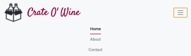

# Testing

- [W3C](https://github.com/kenwilde1/crate-o-wine/blob/main/TESTING.md#w3c)
  - [W3C HTML Validator](https://github.com/kenwilde1/crate-o-wine/blob/main/TESTING.md#w3c-html-validator)
  - [W3C CSS Jigsaw Validator](https://github.com/kenwilde1/crate-o-wine/blob/main/TESTING.md#w3c-css-jigsaw-validator)
- [Performance](https://github.com/kenwilde1/crate-o-wine/blob/main/TESTING.md#performance)
  - [PageSpeed Insights](https://github.com/kenwilde1/crate-o-wine/blob/main/TESTING.md#pagespeed-insights)
  - [Google Lighthouse](https://github.com/kenwilde1/crate-o-wine/blob/main/TESTING.md#google-lighthouse)
- [User Testing](https://github.com/kenwilde1/crate-o-wine/blob/main/TESTING.md#user-testing)
  - [Browser Compatibility](https://github.com/kenwilde1/crate-o-wine/blob/main/TESTING.md#browser-compatibility)
  - [User Stories Testing](https://github.com/kenwilde1/crate-o-wine/blob/main/TESTING.md#user-stories-testing)
  - [Responsiveness Testing](https://github.com/kenwilde1/crate-o-wine/blob/main/TESTING.md#responsiveness-testing)
  - [Peer Code Review](https://github.com/kenwilde1/crate-o-wine/blob/main/TESTING.md#peer-code-review)
  - [User Inputs Testing](https://github.com/kenwilde1/crate-o-wine/blob/main/TESTING.md#user-inputs)
- [Bugs](https://github.com/kenwilde1/crate-o-wine/blob/main/TESTING.md#known-bugs)

## W3C

### W3C HTML Validator

All html written for the site was checked using the HTML Validator on [W3C](https://validator.w3.org/).

- #### index.html

- #### about.html

- #### contact.html

### W3C CSS Jigsaw Validator

The Custom CSS `style.css` was validated using [Jigsaw](https://jigsaw.w3.org/css-validator/validator):

---

## Performance

### PageSpeed Insights

I ran the deployed site through Google's page speed insights. It recommended that up to 4.8 seconds could be saved by compressing all the images into a modern web format.

To remedy this, I compressed all .jpg files into .webp. This reduced the image size by ~40% and thus helped increase page speed.

For example, I compressed the hero image from `.jpg` to `.webp` and was able to see a 44% decrease in image storage size. This was done for all `.jpg` images to enable faster loading times as recommended.

### Google Lighthouse

Google Lighthouse was used to test many factors of the website, mainly - Performance, Accessibility, Best Practices and Search Engine Optimisation.

 

The test scored very well in all tested factors. Best practices scored < 80 due to some render-blocking resources. However, upon diving into these resources, I determined they were critical - bootstrap and font-awesome. They needed to stay in the `<head>` tag so the bootstrap grid and icons were available on page-load.

 

---

## User Testing

### Browser Compatibility

The above HTML and CSS Validators will test for valid code that can run on all browsers.

- **Google Chrome** - The site was built and tested using Chrome Dev Tools, every web component works as expected.
  - **Web Components**: Work as expected.
  - **Links**: Correctly direct user to other parts of their site / open new tab if leaving the site.
  - **Images**: All rendered correctly.
- **Mozilla Firefox**
  - **Web Components**: Work as expected.
  - **Links**: Correctly direct user to other parts of their site / open new tab if leaving the site.
  - **Images**: All rendered correctly.
- **Safari**
  - **Web Components**: Work as expected.
  - **Links**: Correctly direct user to other parts of their site / open new tab if leaving the site.
  - **Images**: All rendered correctly.
- **Opera**
  - **Web Components**: Work as expected.
  - **Links**: Correctly direct user to other parts of their site / open new tab if leaving the site.
  - **Images**: All rendered correctly.
     

|   **Browser**   | Appearance | Responsivness |
| :-------------: | :--------: | :-----------: |
|  Google Chrome  |   _good_   |    _good_     |
| Mozilla Firefox |   _good_   |    _good_     |
|     Safari      |   _good_   |    _good_     |
|      Opera      |   _good_   |    _good_     |

### User Stories Testing

This section will go through each User Story created and see if the objective has succeeded.

- As a User, I want to navigate pages so that I can learn more about the service at my own leisure.

  - When the User visits the site, every page will have a Navbar containing each page - Home, About and Contact.
  - The User can also click on the logo on the Navbar to return to Home at any time.
     

- As a User I want to learn about the service so that I can make an educated purchase.

  - The User is greeted by a Hero Image with some initial text that gives them information straight away.
  - It also provides buttons so they can Learn More or Start Now.
     

- As a User I want to see customer feedback so I can gain trust in the service.

  - There is a customer feedback carousel that will rotate every 5s. Additionally the user can click through each customer review.
     

- As a User, I want to read in-depth information about the service so I can make an educated purchasing decision.

  - The User can navigate to the About page that describes the "What", "How" and "When" of the service.
  - They can navigate to this via the 'Learn More' button or the About Nav Link in the NavBar.
     

- As a User, I want to view the subscription plans so that I can decide which one is best for me.
  - The subscription plans provide a base level of information.
  - The User can learn more about it by clicking on one of the plans, it will bring up a Modal and provide a lot more information.
     
- As a User, I want to contact the product owner to gain more information about the service
  - If the User has more questions or would like to subscribe to the product, they can go to the Contact page.
  - The Contact page has a contact form and address information if they want to get in touch.
     
- As a User, I want to access the product's Social Media so I can keep up to date with the service.
  - The User may want to see the latest news, offers etc for the service.
  - The footer contains all social media links - Facebook, Twitter and Instagram.

### Responsiveness Testing

Before every `git push` to the remote branch, the website was checked for responsiveness to ensure no changes made were breaking.

The following breakpoints were tested (w x h) using Chrome Dev Tools:

- **Desktop** - 1920px x 1080px
- **Tablet**
  - **iPad** - 768px x 1024px
  - **iPad Pro** - 1024px x 1366px
- **Mobile**
  - **Moto G4** - 360px x 640px
  - **Pixel 2** - 411px x 731px
  - **iPhone X** - 375px x 812px
  - **Galaxy Fold** - 280px x 653px
- **Responsive** - dynamic width x height with 100% zoom

Below, the layout of various components will be illustrated with images on each Desktop, Tablet and Mobile. Desktop will include all components while Tablet and Mobile will only include components that are altered significantly when the resolution changes in order to keep this section as succinct as possible.

Where applicable, any responsiveness issues that were encountered for certain components will be explained.

#### Desktop - 1920px x 1080px

- ##### Navbar

The Navbar has two sections, left and right. On the right, we have the logo and title 'Crate O' Wine'. On the right, we have the Nav links - Home, About and Contact. For Desktop view, the active page is highlighted in black and has a red border-bottom.

 

- ##### Index

On the home page, we have the hero image that is stretched to fill the full width of the screen. Inside the hero image, we have an _absolute_ positioned div. The div itself is vertically centered within the hero image. The text is also centered within this div.

 

Below the hero image, we have a promise section. This contains text centered and a button. The container itself takes up 'col-10' in Desktop view in related to Bootstrap Grid. This allows some space around the information.

 

Finally, we have the user feedback carousel. This is responsive and the user can interact with the carousel indicators which causes no negative side effects to the page.

 

- ##### About

The first container is the information container. It contains basic information about the service. The container takes up 'col-10'. Inside, there are two sections text and image. They take up 'col-xl-6' and 'col-xl-4', respectively.

 

The subscription plans also take up 'col-10' of space. This time, it's children Standard and Premium both take up 'col-xl-4' of space. They have a gap in between provided by flexbox.

 

The User can click 'Learn More' on the above plans. This will bring up a modal. The modal is centered on the screen, on desktop there is no need to scroll, the whole modal is visible on desktop.

 

The final section on the About page is the Fairtrade container. Much alike the rest of the components, it takes up 'col-10'. It's children - Image and Text. Taking up 'col-xl-4' and 'col-xl-6', respectively. Conversely to the Information Section above, the image comes before the text.

 

- ##### Contact

The contact container takes up col-10, with an inner-row that takes up 'col-8' to give it a nice width and good centering on the page. It has two input fields - Email and Message.

 

Below this, we have the address section. It also takes up 'col-10' like the rest of the containers on the Desktop resolution. Inside, we have two columns - an imbed iframe and an address info section. Both columns are 'col-6' at Desktop. In order to center the address information, flexbox was used.

 

- ##### Footer

The footer is divided into three evenly spaced sections - Logo, Contact and Socials. Each section took up 'col-4' on the same row. Taking up a total of 'col-12'.

 

#### Tablet - 768px x 1024px

- ##### Navbar

The Navbar becomes a hamburger drop-down menu in order to save space on more narrow screens such as Tablets.

 

- ##### Footer

For the footer, as there was less real-estate for text, the text was reduced by 0.1 - 0.2 rem. This was applied to the 'Get in Touch' section and the 'Social' Icons.

 

#### Mobile - 360px x 640px

- ##### Navbar

At resolutions below ~350px in width, the Navbar was forced to take up another row in order to accomodate the hamburger button. This would also cover any content that was there previously.

 

To remedy this, the logo and title 'Crate O' Wine' size was reduced by ~10%.

 

- ##### Contact

On the Contact page, it was noticed that the form was too big for the current width as can be observed:

 

This was due to the Bootstrap column being too small to accomodate the size of the contact form, in order to fix this, the contact form was changed from 'col-8' to 'col-12' - enabling it to take up the full width of the row.

 

### Peer Code Review

I utilized the `#peer-code-review` to get some outside opinions on my milestone project.

- It was noticed that the buttons on the page would not work if you clicked the border around it - which was bad UX. This was happening as I had an `<a>` tag within my `<button>`.
  - In order to solve this, I removed the `<button>` element and just used the `<a>` tag as a button. This solved the issue.
     
- The Contact form was also too narrow on certain mobile resolutions.
  - This was solved by increasing the column size from 'col-8' to 'col-12'. More can be read about that solution above.

### User Inputs

The only place a user can input their own data is the contact form. As the scope of this project is front-end, we can only implement client-side input validation. To accomplish this every input `type` was set correctly and given the attribute `required`. So if it was an email type, it would require a valid email.

This covered the following scenarios:

- If the user submits an empty form, an appropriate error message tells them to fill in the appropriate (missing) fields.
- If the email address is invalid, the browser will tell the user to adhere to a certain format.

---

### Bugs

- When the device width reaches < 300px, the content starts to get less responsive and stretched.

  - **Solution:** Specifically the Galaxy Fold ~280px width, content was fixed for this width but lower widths are not supported as there are not many devices at this width.
     

- The Inputs in the contact form have placeholders, at small device width (~350px) - the placeholders aren't fully visible.

  - **Solution:** I decreased the font size for the inputs and applied it to a media query at the aformentioned width.
     

- At ~320px, the Navbar could not fit all the items so it spilled into a new row. Subsequently it covered some of the content below it.

  - **Solution:** The Logo and Title size was reduced in order to fit the hamburger menu so it would not spill onto a new row for widths above 120px.
     

- The buttons on the Home page would not work if you clicked the borders of the button. This occurred as inside the button, there was an `<a>` tag that handled the redirect. The border on the button was not apart of the `<a>` tag.

  - **Solution:** I removed the `<button>` tag and just kept the `<a>` tag, this meant the border on the `<a>` tag would be clickable and redirect correctly.
     

- For landscape mode on Mobile phones, 50% of the hero image was covered by the Navbar.
  - **Solution:** I added 100px margin-top to the hero image on devices that had a max-width of 700px and a max-height of 300px.
     
