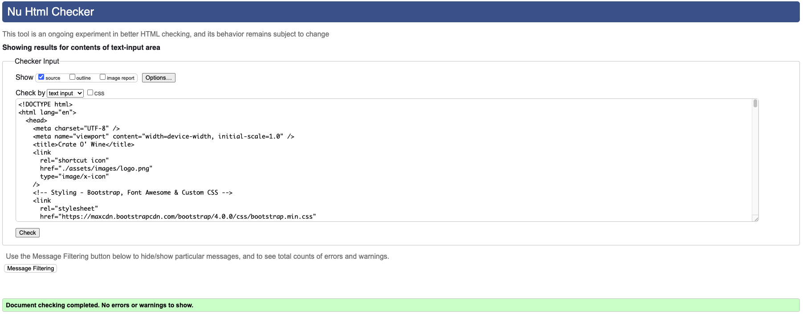

# Testing

- [W3C HTML Validator](https://github.com/kenwilde1/crate-o-wine/blob/main/TESTING.md#w3c-html-validator)
- [W3C CSS Jigsaw Validator](https://github.com/kenwilde1/crate-o-wine/blob/main/TESTING.md#w3c-css-jigsaw-validator)
- [PageSpeed Insights](https://github.com/kenwilde1/crate-o-wine/blob/main/TESTING.md#pagespeed-insights)

### W3C HTML Validator

All html written for the site was checked using the HTML Validator on [W3C](https://validator.w3.org/).

- #### index.html

- #### about.html

- #### contact.html

### W3C CSS Jigsaw Validator

The Custom CSS `style.css` was validated using [Jigsaw](https://jigsaw.w3.org/css-validator/validator):

### PageSpeed Insights

I ran the deployed site through Google's page speed insights. It recommended that up to 4.8 seconds could be saved by compressing all the images into a modern web format.

To remedy this, I compressed all .jpg files into .webp. This reduced the image size by ~40% and thus helped increase page speed.

For example, I compressed the hero image from `.jpg` to `.webp` and was able to see a 44% decrease in image storage size. This was done for all `.jpg` images to enable faster loading times as recommended.

### Google Lighthouse

Google Lighthouse was used to test many factors of the website, mainly - Performance, Accessibility, Best Practices and Search Engine Optimisation.

 

The test scored very well in all tested factors. Best practices scored an ~80 due to some render-blocking resources. However, upon diving into these resources, I determined they were critical - bootstrap and font-awesome. They needed to stay in the `<head>` tag so the bootstrap grid and icons were available on page-load.

 

### Responsiveness Testing

Before every `git push` to the remote branch, the website was checked for responsiveness to ensure no changes made were breaking.

The following breakpoints were tested (w x h):

- **Desktop** - 1920px x 1080px
- **Tablet**
  - **iPad** - 768px x 1024px
  - **iPad Pro** - 1024px x 1366px
- **Mobile**
  - **Moto G4** - 360px x 640px
  - **Pixel 2** - 411px x 731px
  - **iPhone X** - 375px x 812px
  - **Galaxy Fold** - 280px x 653px

#### Desktop - 1920px x 1080px

- ##### Navbar and Footer

The Navbar has two sections, left and right. On the right, we have the logo and title 'Crate O' Wine'. On the right, we have the Nav links - Home, About and Contact. For Desktop view, the active page is highlighted in black and has a red border-bottom.

The footer is divided into three evenly spaced sections - Logo, Contact and Socials.

- ##### Index

On the home page, we have the hero image that is stretched to fill the full width of the screen. Inside the hero image, we have an _absolute_ positioned div. The div itself is vertically centered within the hero image. The text is also centered within this div.

 

Below the hero image, we have a promise section. This contains text centered and a button. The container itself takes up 'col-10' in Desktop view in related to Bootstrap Grid. This allows some space around the information.

 

Finally, we have the user feedback carousel. This is responsive and the user can interact with the carousel indicators which causes no negative side effects to the page.

 

- ##### About

The first container is the information container. It contains basic information about the service. The container takes up 'col-10'. Inside, there are two sections text and image. They take up 'col-xl-6' and 'col-xl-4', respectively.

 

The subscription plans also take up 'col-10' of space. This time, it's children Standard and Premium both take up 'col-xl-4' of space. They have a gap in between provided by flexbox.

 

The User can click 'Learn More' on the above plans. This will bring up a modal. The modal is centered on the screen, on desktop there is no need to scroll, the whole modal is visible on desktop.

 

The final section on the About page is the Fairtrade container. Much alike the rest of the components, it takes up 'col-10'. It's children - Image and Text. Taking up 'col-xl-4' and 'col-xl-6', respectively. Conversely to the Information Section above, the image comes before the text.

 

### User Inputs

The only place a user can input their own data is the contact form. As the scope of this project is front-end, we can only implement client-side input validation. To accomplish this every input `type` was set correctly and given the attribute `required`. So if it was an email type, it would require a valid email.

This covered the following scenarios:

- If the user submits an empty form, an appropriate error message tells them to fill in the appropriate (missing) fields.
- If the email address is invalid, the browser will tell the user to adhere to a certain format.

### Known Bugs

- The Contact Page does not have enough content to enable a scrollbar, when navigating to and from the contact page, the page grows wider / smaller with the absence of a scrollbar. This leads to less than smooth navigation.

- When the device width reaches < 300px, the content starts to get less responsive and stretched.
